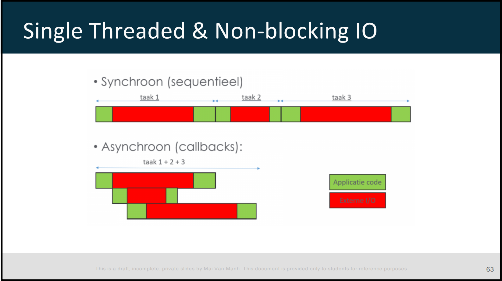
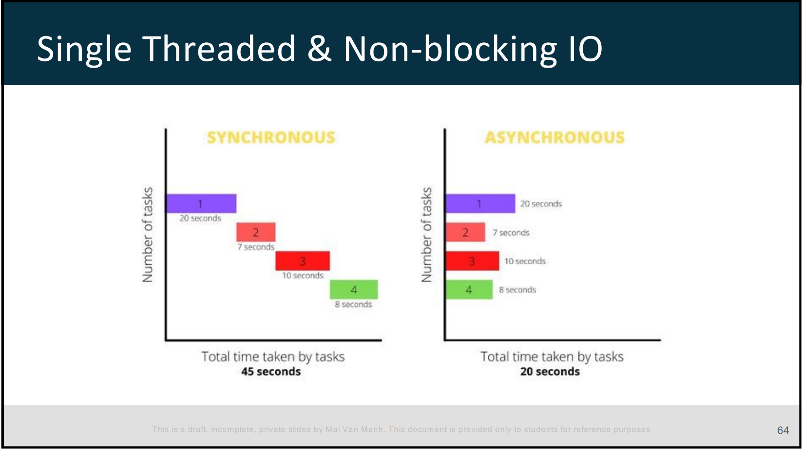

# Javascript and ES6 break-through
1. var,let ,const
2. Template String
3. Object and JSON
4. Destructing assignment and Renaming Variables in it
5. Skipping Elements
6. Rest Syntax
7. Higher order function and arrow function 


Code block (fenced):

```
```

Code block with syntax highlighting:

```javascript
const code = 'example';
```

# Node.js Architecture
- Single-Threaded and Non-blocking I/O
- Event loop
- Modules
- Event emitter and listener
    ## Single-Threaded
  - Event loop to handle mutiple requests
  - handle large number of concurrent requests
  - Single-threaded execution can be a bottleneck for CPU-intensive tasks
  - Node.js provides ways to offload CPU-intensive tasks to other processes or threads.
  



